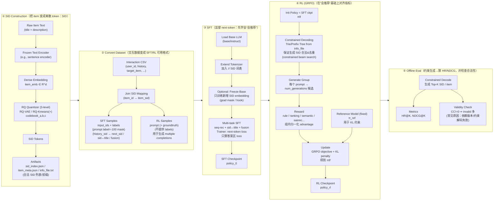

## Labels 对齐可视化（3 条真实样本）

数据来源：`temp/labels_visual_3samples.txt`  
记号约定：`I=instruction`、`P=prompt`、`T=target`。  
训练规则：`label=-100` 不参与 loss；`label=input_id` 参与 loss。

### 1) 总览

| Dataset | 样本来源 | full_len | I_len | P_len | T_len | split(I+P) | 可训练区间 |
|---|---|---:|---:|---:|---:|---:|---|
| `SidSFTDataset` | `train.csv` row0 | 85 | 44 | 36 | 5 | 80 | `pos 80..84` |
| `SidItemFeatDataset` | `item_id=0` (`sid2title`) | 82 | 38 | 19 | 25 | 57 | `pos 57..81` |
| `FusionSeqRecDataset` | `train.csv` row0 | 103 | 46 | 38 | 19 | 84 | `pos 84..102` |

### 2) 边界切换（`-100` -> 可训练）

| Dataset | pos | seg | input_id | input_tok | label | train |
|---|---:|:---:|---:|---|---:|---:|
| `SidSFTDataset` | 78 | P | 5949 | `\u0120Response` | -100 | 0 |
| `SidSFTDataset` | 79 | P | 510 | `:\u010a` | -100 | 0 |
| `SidSFTDataset` | 80 | T | 151666 | `<a_104>` | 151666 | 1 |
| `SidSFTDataset` | 81 | T | 151812 | `<b_118>` | 151812 | 1 |
| `SidSFTDataset` | 82 | T | 152126 | `<c_176>` | 152126 | 1 |
| `SidItemFeatDataset` | 55 | P | 5949 | `\u0120Response` | -100 | 0 |
| `SidItemFeatDataset` | 56 | P | 510 | `:\u010a` | -100 | 0 |
| `SidItemFeatDataset` | 57 | T | 75932 | `SUP` | 75932 | 1 |
| `SidItemFeatDataset` | 58 | T | 8281 | `CO` | 8281 | 1 |
| `SidItemFeatDataset` | 59 | T | 328 | `\u0120S` | 328 | 1 |
| `FusionSeqRecDataset` | 82 | P | 5949 | `\u0120Response` | -100 | 0 |
| `FusionSeqRecDataset` | 83 | P | 510 | `:\u010a` | -100 | 0 |
| `FusionSeqRecDataset` | 84 | T | 6464 | `Gr` | 6464 | 1 |
| `FusionSeqRecDataset` | 85 | T | 72725 | `izzly` | 72725 | 1 |
| `FusionSeqRecDataset` | 86 | T | 479 | `\u0120G` | 479 | 1 |

### 3) Target 区（全部 `train=1`）示例

| Dataset | target 文本（节选） | target token ids（节选） |
|---|---|---|
| `SidSFTDataset` | `<a_104><b_118><c_176>\n` | `151666, 151812, 152126, 198, 151643` |
| `SidItemFeatDataset` | `SUPCO SPP6 Relay/Capacitor ... Torque\n` | `75932, 8281, 328, 4406, ..., 591, 198, 151643` |
| `FusionSeqRecDataset` | `Grizzly G9849 Magnetic Base/Dial Indicator Combo - President's Special\n` | `6464, 72725, 479, 24, ..., 9785, 198, 151643` |

### 4) 一句话结论

三类样本完全一致：`instruction+prompt` 全部 `label=-100`；从 `split` 起进入 `target` 区，逐 token 监督学习。
